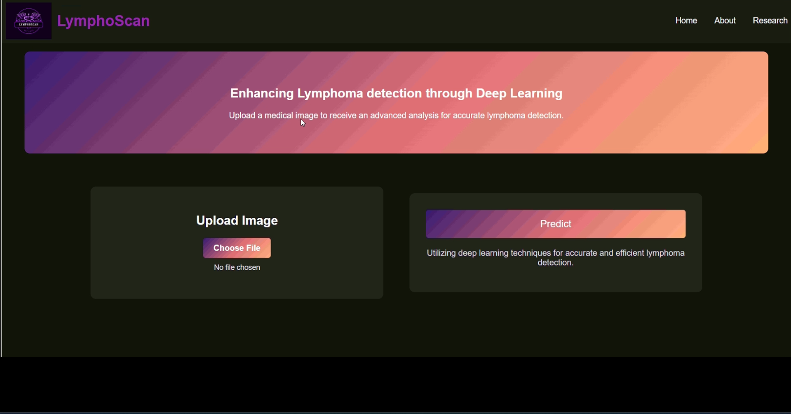
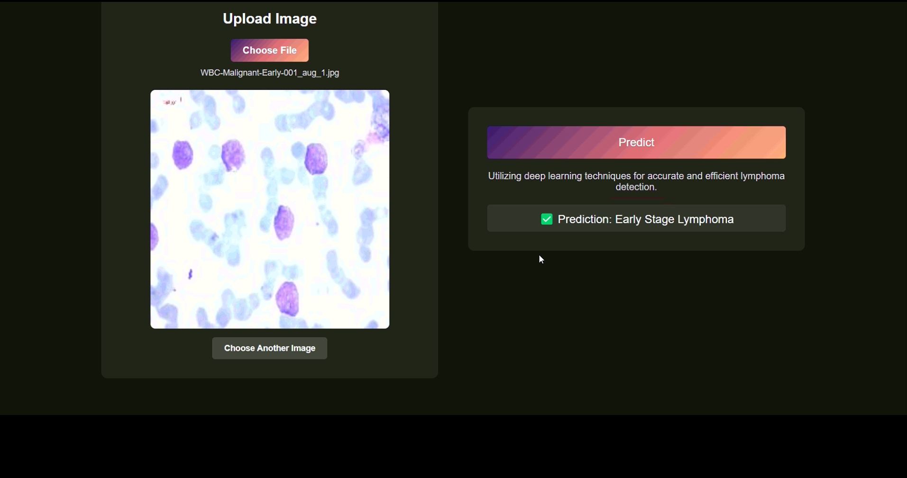
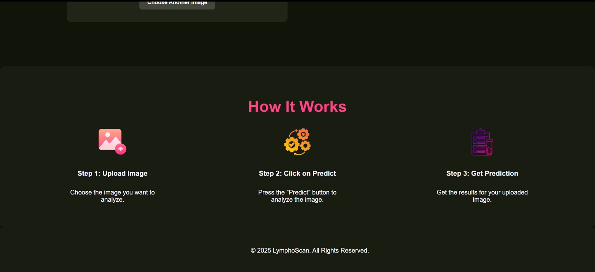

# LymphoScan — How It Works

LymphoScan pairs a simple *HTML/CSS/JS* interface with a *Flask* API and a fine-tuned *Swin Transformer* image classifier (PyTorch). The goal is fast lymphoma-type screening from a single uploaded image.

## End-to-End Flow
1. *User uploads an image* on the web UI (index.html). JavaScript (scripts.js) previews the image and sends it as multipart/form-data to the Flask endpoint **/predict** via fetch().
2. *Flask receives the file* (app.py), saves it under static/uploads/, opens it with *PIL, and **preprocesses* it using torchvision transforms (resize / tensor conversion / ImageNet normalization).
3. The *Swin model* (either transformers.SwinForImageClassification or the SwinModel defined in model_architecture.py) is loaded with *fine-tuned weights* and set to eval() on CPU/GPU.
4. The preprocessed tensor is passed through the model. The *argmax* of the logits picks the predicted class index, which is mapped to a human-readable label (e.g., Benign, Blood Cancer, CLL, Early, FL, MCL, Pre, Pro, Non-Cancer, Unknown).
5. Flask returns *JSON* ({"prediction": "<label>"}), and the frontend displays the result in the UI.

## Data & Preprocessing
- Training data is organized in *class-named folders* (e.g., .../train/Benign, .../train/Blood_Cancer, …).  
- preprocess.py performs *data augmentation* to improve robustness (RGB conversion + brightness/contrast tweaks, geometric variations) and saves augmented images alongside originals.
- During inference, images are normalized to ImageNet stats and resized/cropped to the Swin input size (224×224), matching training transforms.

## Model & Training
- model_architecture.py defines a *Swin V2 Tiny* backbone (torchvision.models.swin_v2_t) with a custom *linear head* sized to the project’s class count.  
- train_model.py fine-tunes a *SwinForImageClassification/Swin V2* model using cross-entropy loss and an optimizer with a learning-rate scheduler; *AMP (mixed precision)* is enabled for speed when CUDA is available.
- evaluate_model.py reports *classification metrics* (precision/recall/F1) and a confusion matrix using scikit-learn to validate performance on a held-out set.

## Prediction Script (CLI)
- Predict.py loads the fine-tuned Swin weights and predicts a class for a single image given via command-line argument, mirroring the Flask /predict logic.

## Frontend Details
- index.html renders the layout (navigation, upload area, results section).  
- scripts.js handles *file preview, **reset*, and the **/predict** POST.  
- styles.css provides a responsive look-and-feel.

## Screenshots

## What This Demonstrates
- A clear separation of *UI, **API, and **ML* responsibilities.  
- A practical transfer-learning setup where a modern transformer (Swin) is fine-tuned for *lymphoma image classification*, then served via a lightweight Flask endpoint and consumed by a browser-based UI.
